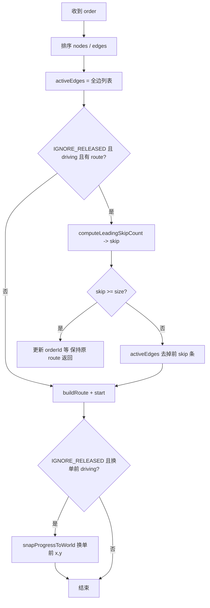

# IGNORE_RELEASED：行驶中途收到新 Order 的前导边裁剪设计

**文档状态**：与当前实现对齐  
**适用范围**：`orderExecutionMode: IGNORE_RELEASED` 下，车辆在 **尚未跑完当前路径** 时再次收到 MQTT `order`（或更高 `orderUpdateId` 的替换单）时的行为。  
**相关代码**：`IgnoreReleasedActiveEdgeTrimmer`、`SimulationEngine.onOrderMessage`、`RouteFollower.snapProgressToWorld`

---

## 1. 背景

### 1.1 业务场景

联调 AOS 时常见流程如下：

1. 首单路径为多段边，例如节点 **1 → 2 → 3**（两条边：`1→2`、`2→3`）。
2. 车辆在 **2 与 3 之间**行驶（尚未到达 3）时，现场通过 **及时报文**（如 `instantActions`）与主站交互。
3. AOS 随后下发一条 **新的 `order`**。新单里往往仍包含 **从起点开始的完整边序列**（例如再次列出 `1→2`、`2→3`，或更长 horizon），与车辆 **已经驶过的前缀** 在拓扑上重复。

在该模式下，模拟器 **不按 `released` 过滤边**，会对订单中的 **全部边** 参与路径规划（见《订单边执行模式设计》中 `IGNORE_RELEASED` 定义）。若不做额外处理，每次新单都会按 **第一条边** 重建 `RouteFollower`，语义上等价于让车 **从第一段路径起点重新跑**，表现为路径 **回头**、位姿 **跳回** 已驶过区段，与真实车辆「继续沿当前未完成路段行驶」不符。

### 1.2 问题归纳

| 现象 | 说明 |
|------|------|
| **回头 / 拉回** | 新 `order` 到达后，仿真位姿回到 **当前订单第一条边** 的几何起点（或接近起点），而非保持 **当前世界坐标** 沿 **剩余边** 前进。 |
| **全冗余单** | 新单若仅重复「已经执行完或等价已覆盖」的边序列，车辆应 **保持当前运动**，仅同步 `orderId` / `orderUpdateId`，不应清空或重绑路径。 |

### 1.3 设计目标

1. **前缀可丢弃**：新单中与 **已驶过路径** 一致的 **前导边** 不再执行；仅对 **后缀边** 建路径并继续行驶。
2. **位姿连续**：换单重建路径后，在 **同一条未完成边** 上应保持 **沿路径的弧长进度** 与换单前 **世界坐标** 一致（允许在首段上做一次 **投影/吸附**，避免 `start()` 将进度重置到段首）。
3. **命名鲁棒**：订单 `nodes[]` 与边上 `startNodeId`/`endNodeId` 可能存在 **VDA 短名** 与 **OpenTCS 全名** 混用、或 `findOrderNode` 偶发解析失败；边匹配需在 **逻辑节点** 层面一致（经 `Vda5050MapNameCodec` 归一化），并在解析失败时 **回退到边字段原始字符串** 比较。
4. **与现有模式正交**：不改变 `IGNORE_RELEASED` 对 `released` 的忽略策略，不改变「中间途经点抑制纯节点 state」等策略；本设计 **仅** 约束「行驶中换单」时的 **activeEdges 子集** 与 **RouteFollower 初始化后的进度对齐**。

---

## 2. 方案总览

在 `SimulationEngine.onOrderMessage` 中，在已通过 `ReleasedEdgeSelector` 得到 **可执行边列表**（本模式下为 **全排序边**）之后、调用 `OrderRoutePlanner.buildRoute` 之前，增加一步 **前导边裁剪**：

1. **条件**：`IGNORE_RELEASED` 且 **当前存在** `RouteFollower` 且 **`driving == true`** 且 `activeEdges` 非空。
2. **输入**：新单的 `activeEdges`、`sortedNodes`、当前 `route`（含段索引与每段起终点逻辑名）。
3. **输出**：非负整数 **`skip`**（需跳过的前导边条数）。  
   - `skip == 0`：不裁剪。  
   - `0 < skip < activeEdges.size()`：`activeEdges := activeEdges[skip .. end)` 再建路径。  
   - `skip >= activeEdges.size()`：新单 **不增加** 可执行后缀 — **保留当前 `route`**，仅更新订单标识后返回（全冗余）。

路径 **构建成功** 并 `route.start()` 后，若本次为 **行驶中换单**（`IGNORE_RELEASED` 且换单前 `driving == true`），对 **新世界坐标**（换单前的 `x,y`）调用 `RouteFollower.snapProgressToWorld`，使首段上的弧长进度与当前位置一致，避免段首重置造成的 **视觉回头**。

---

## 3. 前导条数：`computeLeadingSkipCount`

实现类：`IgnoreReleasedActiveEdgeTrimmer`。

### 3.1 符号

- `segIdx = route.getCurrentSegmentIndex()`：当前正在执行的 **段下标**（0 表示第一条边，1 表示第二条边，以此类推）。
- `n = activeEdges.size()`：新单中参与匹配的边条数。
- **边匹配**：新单第 `j` 条边的 `startNodeId`/`endNodeId` 与当前 route 第 `j` 段的 `segFrom(j)`/`segTo(j)` 在 **逻辑节点** 上是否一致（见 3.3）。

### 3.2 算法（两阶段）

**阶段 A — 已完成前缀（优先）**

若 `segIdx > 0`，检查新单中前 **`segIdx` 条边**（下标 `0 .. segIdx-1`）是否分别与 **当前 route** 的段 `0 .. segIdx-1` 一一匹配。

- 若 **全部匹配**，则返回  
  `skip = min(segIdx, n)`。

**设计说明（关键）**：车辆 **已经驶完** 段 `0 .. segIdx-1`，新单若重复列出这些边，应 **整段跳过**，**不要求** 新单第 `segIdx` 条边与「当前正在走的段」再做一次严格匹配。历史上若强制要求 `activeEdges[segIdx]` 与当前段一致，会在 **节点解析不一致** 时得到 `skip = 0`，从而 **整单从第一条边重建**，引发 **回头**。放宽后，只要 **已完成前缀** 对齐，即跳过 `segIdx` 条前导边。

**阶段 B — 当前段对齐（回退）**

若阶段 A 未命中，则扫描 `i = 0 .. n-1`，找到 **第一条** 与新单边匹配 **当前段** `route.getSegFrom(segIdx)` / `getSegTo(segIdx)` 的边，返回 **`skip = i`**。

若仍无匹配，返回 **`skip = 0`**（退化行为：按未裁剪边建路径；随后仍可通过 `snapProgressToWorld` 减轻同段内的段首跳变，见第 4 节）。

### 3.3 边匹配：`edgeMatchesRouteSegment`

对每条边的 `startNodeId`、`endNodeId`：

1. 优先通过 `OrderRoutePlanner.findOrderNode(sortedNodes, ·)` 解析到 `nodes[]` 中的节点，取 `nodeId` 与 route 端点做 `sameLogicalNode`（内部对两端字符串使用 `Vda5050MapNameCodec.toVehicleNodeId` 归一化后比较）。
2. 若某一端 **无法在 `nodes[]` 中解析**，则 **回退** 为边上 **原始字符串** 与 route 端点做 `sameLogicalNode`，避免因 `nodes[]` 与边引用不一致导致 **整条边判失败**。

---

## 4. 位姿连续：`snapProgressToWorld`

`RouteFollower.start()` 会将段索引置 0、段内弧长置 0，并从 **首段几何** 取初始位姿。裁剪前导边后，**新的**首段对应 **剩余路径的第一条边**；若车辆仍处在该边 **中段**，必须在首段上对 **换单前世界坐标 `(wx, wy)`** 做一次吸附。

实现：`RouteFollower.snapProgressToWorld(wx, wy)` — 在 **当前首段** 上对弧长做离散采样，选取与 `(wx, wy)` **欧氏距离最小** 的样本点，设置 `posInSegM` 并 `refreshPose()`。

**调用条件**（与「是否发生过前导裁剪」解耦）：

- `IGNORE_RELEASED` 且 **换单前** `driving == true`（行驶中收到新单并 **成功重建** `RouteFollower`）。  
- 首单从静止下发时换单前 `driving == false`，**不**做 snap，避免无意义的数值调整。

这样即使 `skip == 0`（例如仍处在 **第一条边** 中段、阶段 B 未裁掉任何边），也能避免 **仅 `start()`** 导致的 **回到段首**。

---

## 5. 与其它组件的关系

| 组件 | 作用 |
|------|------|
| `ReleasedEdgeSelector` | `IGNORE_RELEASED` 下返回 **全部排序边**，作为裁剪的输入列表。 |
| `OrderRoutePlanner.buildRoute` | 仅对 **裁剪后的** `activeEdges` 构建 `MotionSegment` 列表与 `segFrom`/`segTo`。 |
| `RouteFollower` | 提供 `getCurrentSegmentIndex()`、`getSegFrom`/`getSegTo`；裁剪后新 route 的段 0 对应 **剩余第一条边**。 |
| `Vda5050MapNameCodec` | 节点逻辑名一致性的唯一归一化入口，与订单、plant、state 命名策略一致。 |

---

## 6. 边界与限制

1. **拓扑不一致**：若新单前导边与已驶路径 **无法** 在节点层面对齐，阶段 A/B 可能均无法裁出合理 `skip`；此时行为退化为 **全量建路径 + snap**，极端情况下几何上仍可能不理想，需依赖 **订单数据与地图一致**。
2. **`skip >= size`**：表示新单没有可执行的 **新后缀**；实现上 **保留原 route** 并更新订单号，避免无路径可建。
3. **非 IGNORE_RELEASED 模式**：不启用本前导裁剪逻辑；`STRICT_PREFIX_RELEASED` 等仍按各自 released 前缀语义执行。

---

## 7. 相关文档

- 《[订单边执行模式设计](./订单边执行模式设计.md)》— `IGNORE_RELEASED` / `STRICT_PREFIX_RELEASED` 总述与 state 策略。
